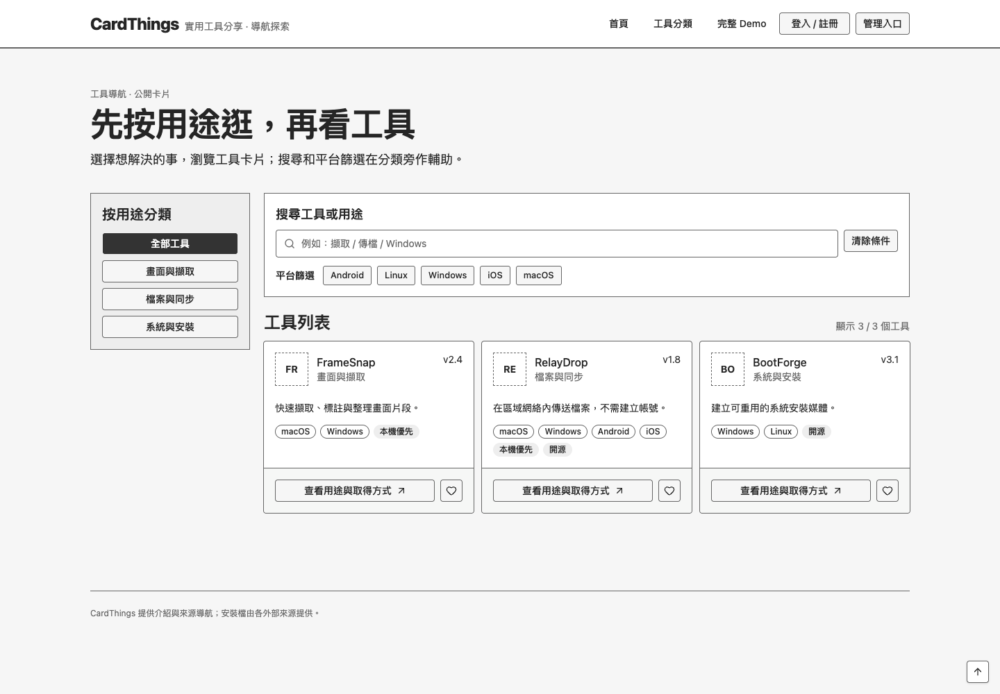
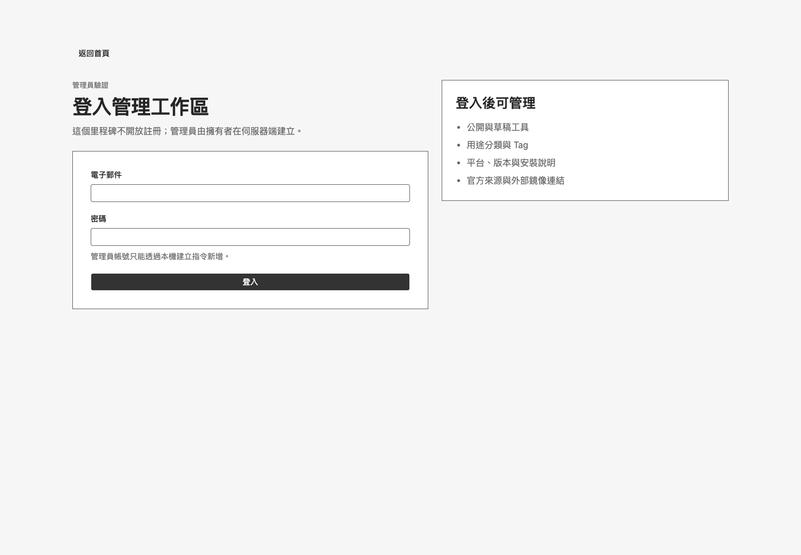
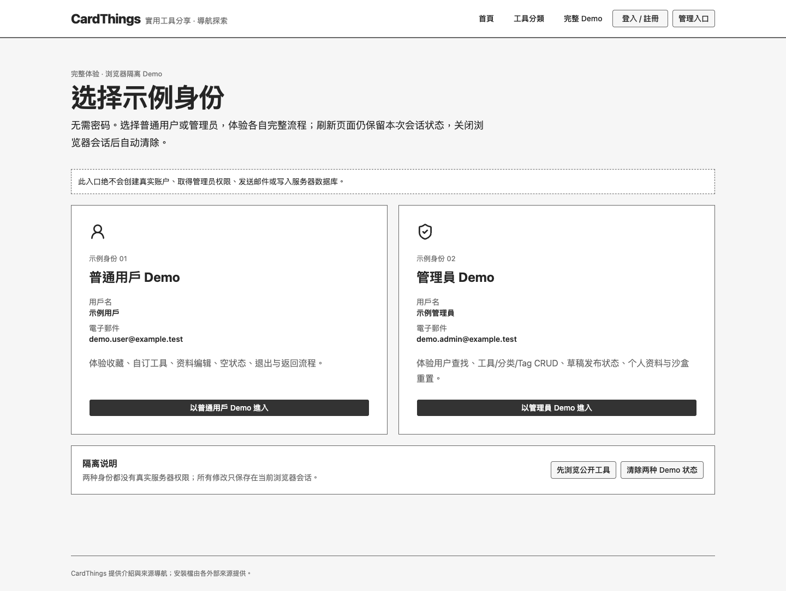
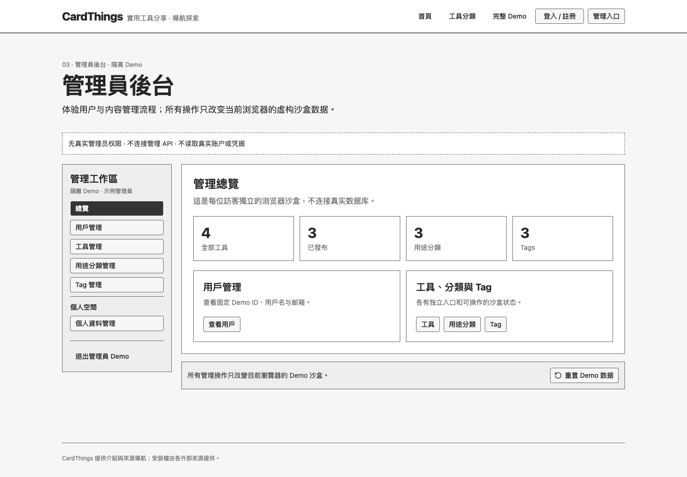
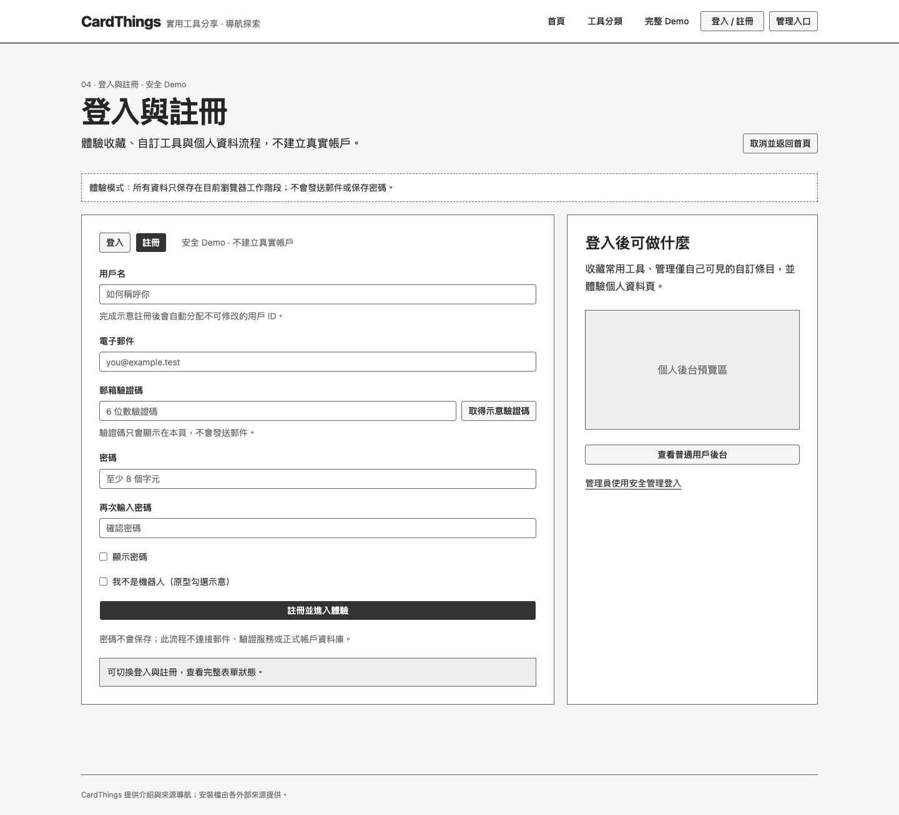
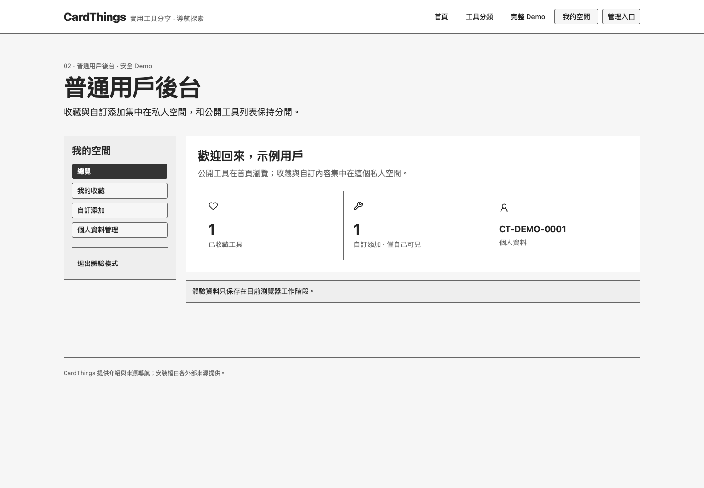
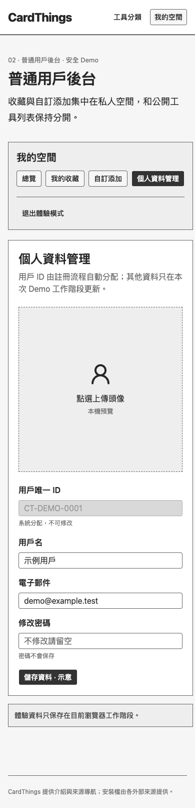
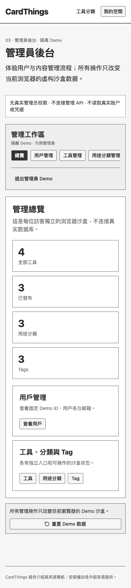
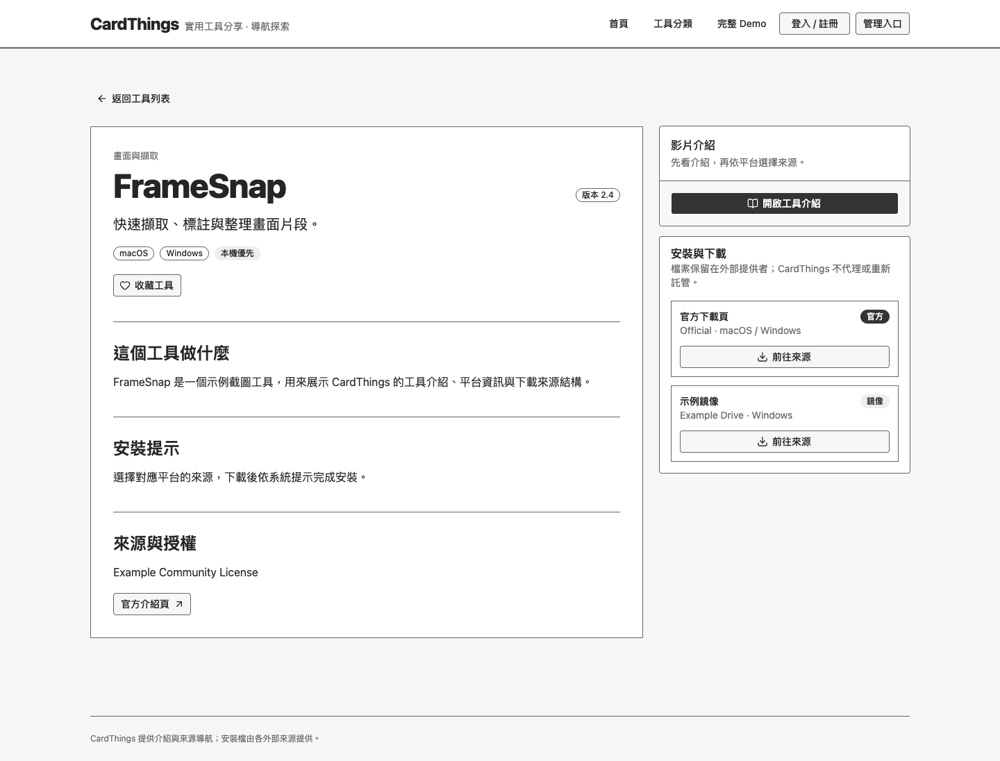

# CardThings

CardThings is a generic, self-hosted catalogue for curated software and other link-based collections. Visitors browse public cards and dedicated detail pages; administrators manage tools, categories, tags, publication state, and external download sources.

CardThings stores descriptions and links, not installer binaries. Official and mirror files remain with their external providers.



## First milestone

- Public catalogue with text, category, and platform filters
- Published-only detail routes with version, installation, source, licence, episode, and download metadata
- Explicit official or mirror source labels; every download opens the external provider
- Custom admin login and server-authorized tool, category, and tag CRUD
- Draft and published tool states
- Deterministic fictional seed data that inserts missing rows without replacing edits
- SQLite migrations, persistent Docker volumes, and documented backup/restore procedures
- A browser-session Demo flow for visitor registration, login, favourites, private custom tools, and profile editing
- Protected administrator overview, user listing, tool, category, tag, and profile pages

The visitor account experience is intentionally a review prototype. It stores fictional state in the current browser session, never stores passwords, and never sends email or CAPTCHA requests. Real visitor accounts, server-backed favourites and profiles, uploads, and binary hosting remain outside this milestone.



## Review the complete flow

Start the app, then use these routes:

- `/` — public catalogue, filtering, favourites, and tool cards
- `/tools/framesnap` — dedicated tool detail and external source labels
- `/auth?register=1` — safe registration Demo with visible example verification code
- `/user` — Demo overview, favourites, private custom tools, and profile editing
- `/demo` — explicit ordinary-user and isolated administrator Demo personas
- `/demo/admin` — browser-local administrator CRUD sandbox with no server permissions
- `/admin/login` — real administrator authentication; there is no default password

Clicking a card's heart while signed out opens the Demo login flow. Completing it returns to the original catalogue or detail page and applies the pending favourite. The administrator route is separate and cannot be entered through the visitor Demo.

For a complete review without real credentials, start at `/demo`. The administrator persona uses a separate versioned `sessionStorage` sandbox. Tool, category, tag, profile, reset, and logout actions never call the authentication API or write the SQLite database.









The same workspace collapses into a touch-friendly mobile layout:





## Stack

- Next.js 16, React 19, and TypeScript
- Tailwind CSS 4 with selected shadcn/ui primitives
- SQLite with Drizzle ORM and committed migrations
- Better Auth email/password sessions
- Playwright and Vitest
- Docker Compose

## Local setup

Requires Node.js 22.12 or newer.

```bash
npm ci
cp .env.example .env.local
openssl rand -base64 32
```

Put the generated value in `BETTER_AUTH_SECRET` inside `.env.local`, then initialize the local development database:

```bash
npm run db:migrate
npm run db:seed
```

Create the first administrator without saving a password in the repository or shell history:

```bash
export ADMIN_EMAIL="admin@example.test"
export ADMIN_NAME="Local administrator"
read -s ADMIN_PASSWORD
export ADMIN_PASSWORD
npm run admin:create
unset ADMIN_PASSWORD
```

Passwords must be at least 12 characters. No default administrator exists. Start the app at [http://127.0.0.1:3000](http://127.0.0.1:3000):

```bash
npm run dev
```

## Docker Compose

Copy `.env.example` to `.env`, replace `BETTER_AUTH_SECRET`, and set `BETTER_AUTH_URL` to the public origin before production use.

```bash
docker compose up --build -d app
```

The app applies committed migrations at startup but does not seed production automatically. To intentionally add the fictional missing-only samples:

```bash
docker compose --profile tools run --rm \
  -e ALLOW_PRODUCTION_SEED=true manager npm run db:seed
```

Create an administrator through the short-lived management container:

```bash
export ADMIN_EMAIL="admin@example.test"
read -s ADMIN_PASSWORD
export ADMIN_PASSWORD
docker compose --profile tools run --rm \
  -e ADMIN_EMAIL -e ADMIN_PASSWORD manager npm run admin:create
unset ADMIN_PASSWORD
```

The running app uses Next.js standalone output, so development and peer-only toolchains are absent from the runtime image. The separate `manager` profile contains the TypeScript tooling required for deliberate migration, seed, and account-management commands and does not run as a service.

See [Operations](docs/operations.md) for migration review, volume backup, restore, and environment separation.

## Verification

```bash
npm run lint
npm run typecheck
npm test
npm run test:e2e
npm run build
```

The end-to-end suite creates and removes only `data/e2e.sqlite*`, starts a local test server, verifies anonymous admin protection and authenticated persistence, and exercises the public catalogue and favourite return flow on desktop and mobile Chrome. It also covers registration, private custom tools, profile updates, and logout in Demo mode.

Documentation screenshots are captured from a running local build with fictional data:

```bash
SCREENSHOT_BASE_URL=http://127.0.0.1:3000 npm run screenshots
```

For a time-boxed external design review, place the included read-only Demo gateway in front of a local app process instead of exposing the application port directly. The gateway listens only on loopback, allows public and Demo GET/HEAD routes, rejects `/admin`, `/api`, all writes, and expires after two hours by default:

```bash
DEMO_GATEWAY_TARGET=http://127.0.0.1:3000 npm run demo:gateway
```

Only connect a temporary HTTPS tunnel to the gateway's `127.0.0.1:3311` endpoint after reviewing the tunnel provider and audience. See [Operations](docs/operations.md#isolated-demo-preview) for the exact boundary and shutdown procedure.

## Data safety

- `data/`, `uploads/`, environment files, backups, and SQLite sidecar files are ignored by Git and Docker build context.
- The repository contains only fictional `example.com` samples.
- Development/test files and production Docker volumes use independent paths.
- Seeding is insert-only and requires an explicit production opt-in; it never updates an existing row.
- Every admin mutation checks the server session and administrator role before writing.
- Migrations are generated as reviewable SQL and are never generated automatically at application startup.


