# Rendered previews

These images are captured from the running CardThings application and committed with the code they represent. Stable filenames let Git history show the matching interface at any reviewable commit.

## Collection — desktop

1440 × 1000 Chromium viewport.

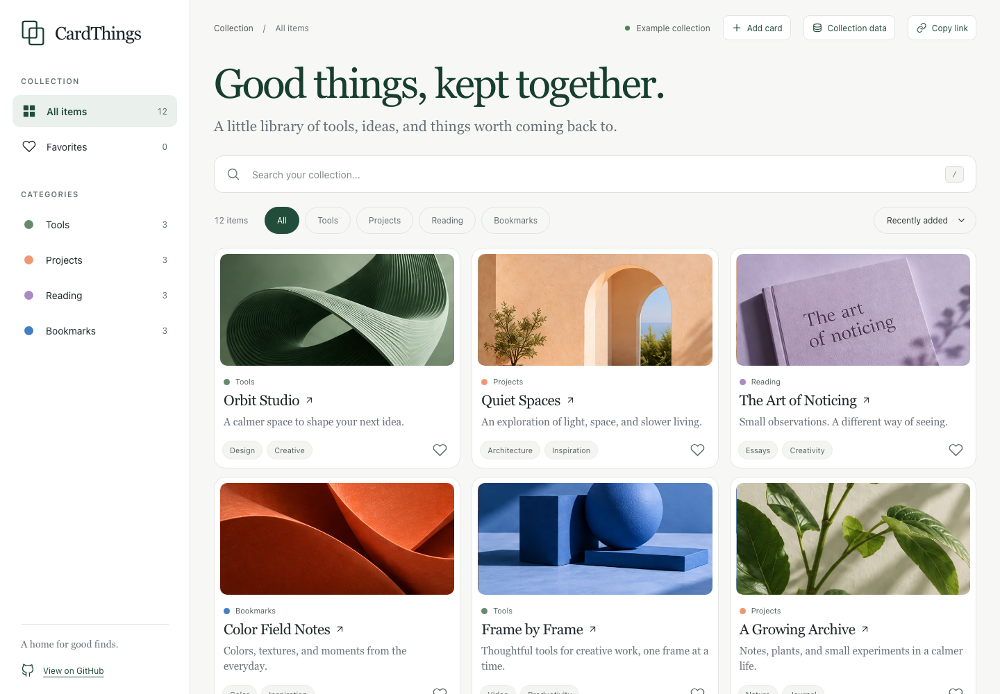

## Collection — mobile

390 × 844 Chromium viewport. The navigation, toolbar, and cards use the mobile layout.

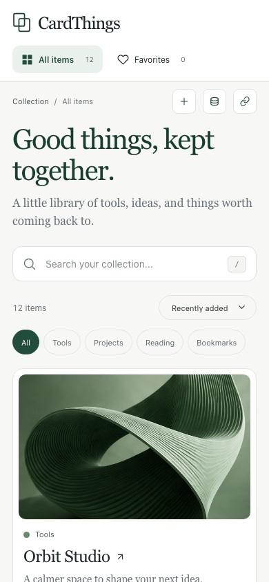

## Guided card editor — desktop

1440 × 1000 Chromium viewport with a new card draft. Required content, optional metadata, and the beginning of the cover section fit in one scrollable modal.

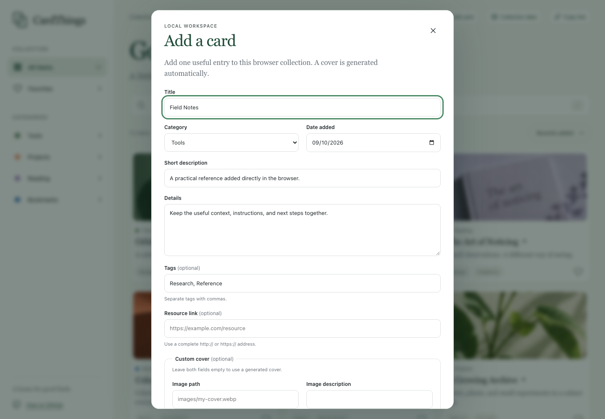

## Guided card editor — mobile

390 × 844 Chromium viewport with the same add-card flow in its single-column mobile layout.

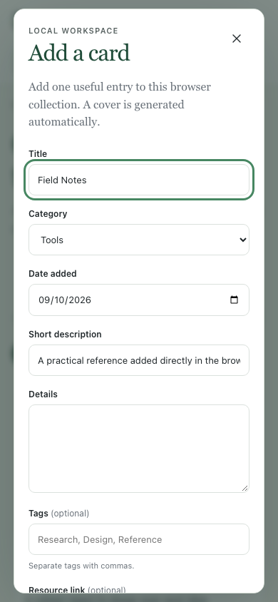

## Item details

1440 × 1000 Chromium viewport with the Orbit Studio detail dialog open.

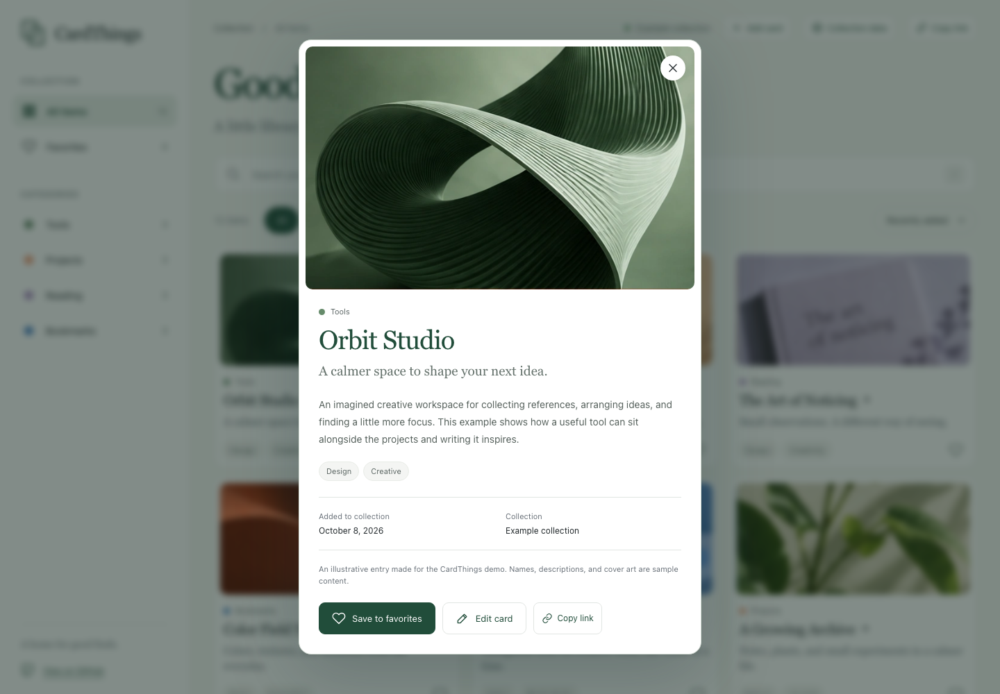

## Collection data

1440 × 1000 Chromium viewport with the starter, import, and export actions open.

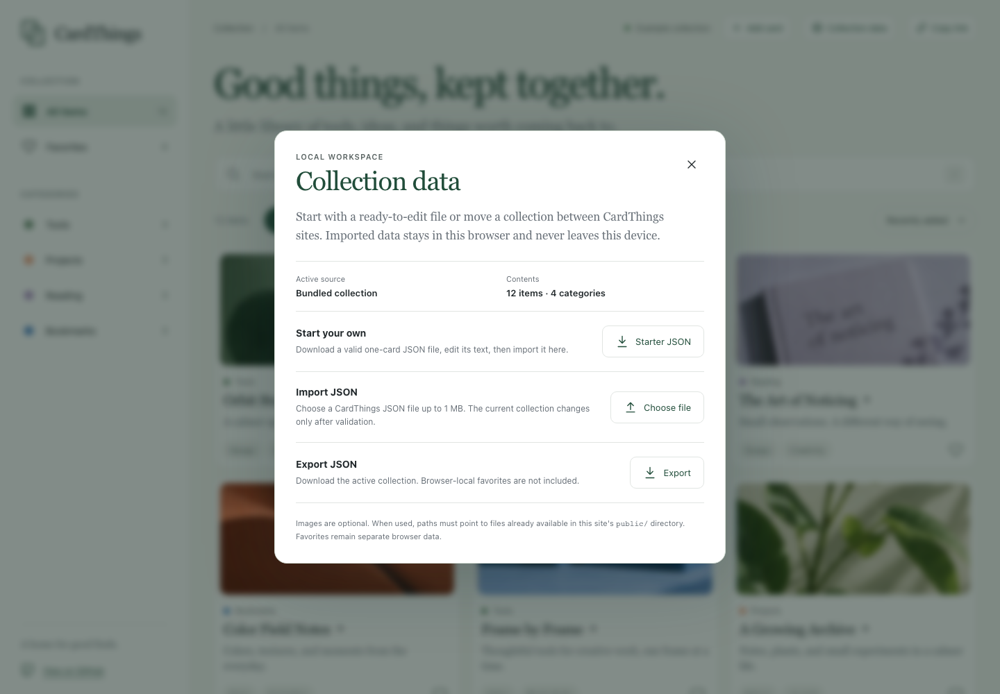

## Zero-asset starter collection

1440 × 1000 Chromium viewport after importing the downloaded one-card starter. Its generated cover uses the item initials and category color without an image request.

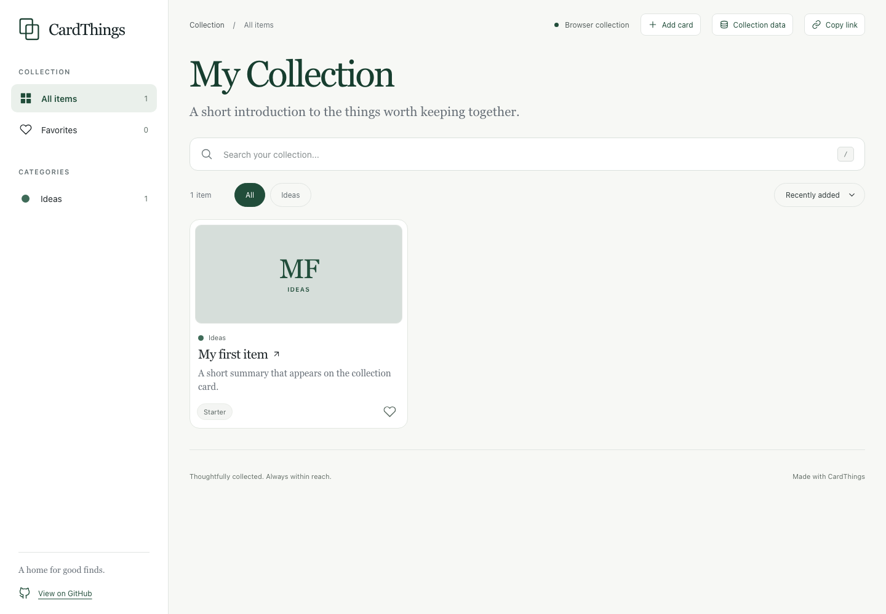

## Missing image preflight

1440 × 1000 Chromium viewport after a schema-valid import references a local image that the site cannot load. The active bundled collection remains visible behind the dialog.

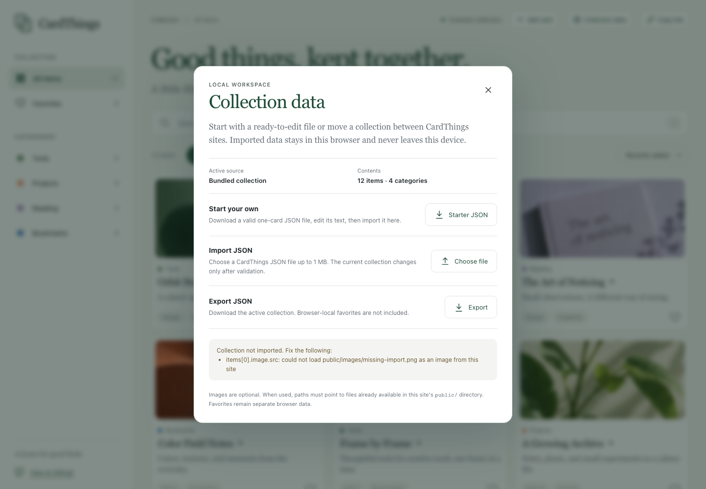

## Cross-tab favorites synchronization

1440 × 1000 Chromium viewport after a second tab favorites Orbit Studio. The receiving tab updates its count and control state, then explains the external change in the page.

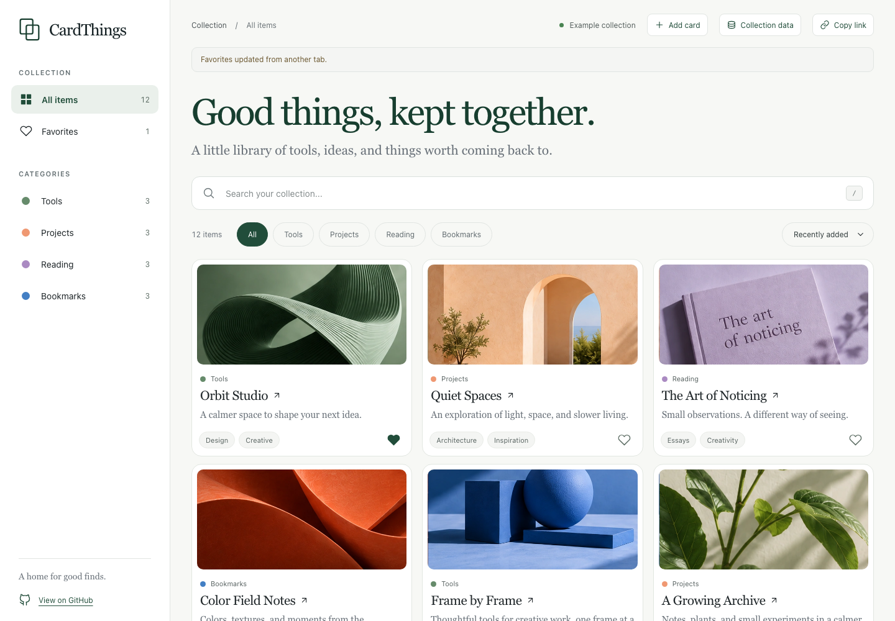

## Empty favorites — mobile

390 × 844 Chromium viewport showing the actionable empty state.

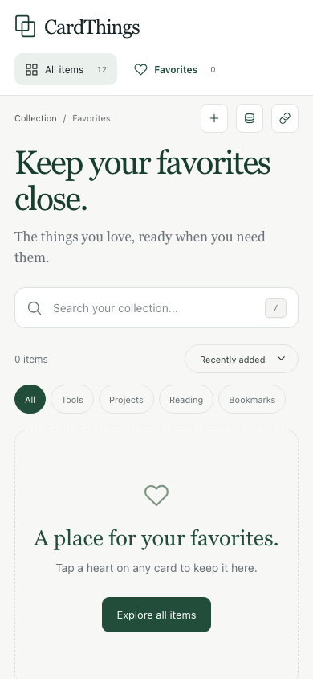

## Runtime image fallback — mobile

390 × 844 Chromium viewport with the bundled cover request intentionally failed. Cards retain their layout and show an accessible fallback.

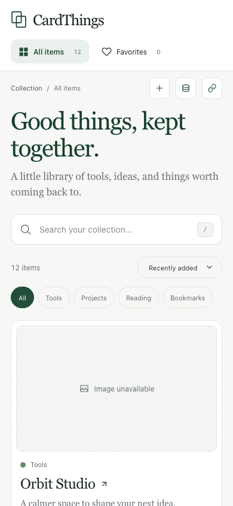

## Regenerate

From the repository root, install Chromium once, start the fixed local server, and run the capture script in a second terminal:

```sh
npx playwright install chromium
npm run dev -- --port 4173 --strictPort
```

```sh
npm run capture:previews
```

The script targets `http://127.0.0.1:4173/` by default, clears storage in its isolated browser pages, and overwrites these stable files. It captures the current rendered UI; it does not generate or compose mockups. Review every image before committing it with the corresponding frontend change.
